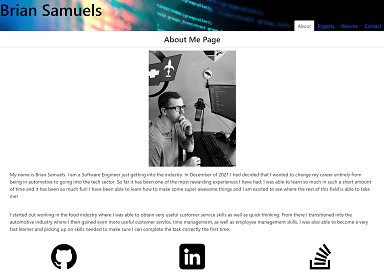

# My-portfolio
This is my professional portfolio. It has links for my professional socials as well as some of the projects that I have been honored to be a part of!

## Usage

To be able to use this click on the deployed application link and browse the portfolio!

## Download

To be able to download the code for the portfolio fork the repository from Github!

## Mock up image 



## Link to deployed application

<a href="https://samuels1996.github.io/My-portfolio/">Click me!</a>

## Acceptance critera

```md
GIVEN a single-page application portfolio for a web developer
WHEN I load the portfolio
THEN I am presented with a page containing a header, a section for content, and a footer
WHEN I view the header
THEN I am presented with the developer's name and navigation with titles corresponding to different sections of the portfolio
WHEN I view the navigation titles
THEN I am presented with the titles About Me, Portfolio, Contact, and Resume, and the title corresponding to the current section is highlighted
WHEN I click on a navigation title
THEN I am presented with the corresponding section below the navigation without the page reloading and that title is highlighted
WHEN I load the portfolio the first time
THEN the About Me title and section are selected by default
WHEN I am presented with the About Me section
THEN I see a recent photo or avatar of the developer and a short bio about them
WHEN I am presented with the Portfolio section
THEN I see titled images of six of the developer’s applications with links to both the deployed applications and the corresponding GitHub repositories
WHEN I am presented with the Contact section
THEN I see a contact form with fields for a name, an email address, and a message
WHEN I move my cursor out of one of the form fields without entering text
THEN I receive a notification that this field is required
WHEN I enter text into the email address field
THEN I receive a notification if I have entered an invalid email address
WHEN I am presented with the Resume section
THEN I see a link to a downloadable resume and a list of the developer’s proficiencies
WHEN I view the footer
THEN I am presented with text or icon links to the developer’s GitHub and LinkedIn profiles, and their profile on a third platform (Stack Overflow, Twitter)
```
## Contributions

Thank you to the following: 
* Vodka Crans
* Seamona Stewart
